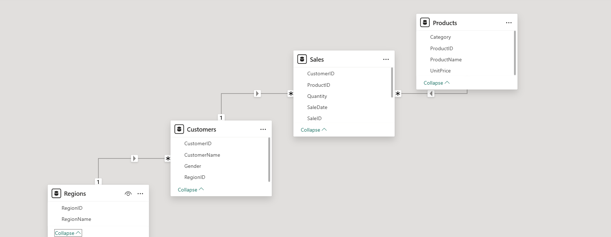
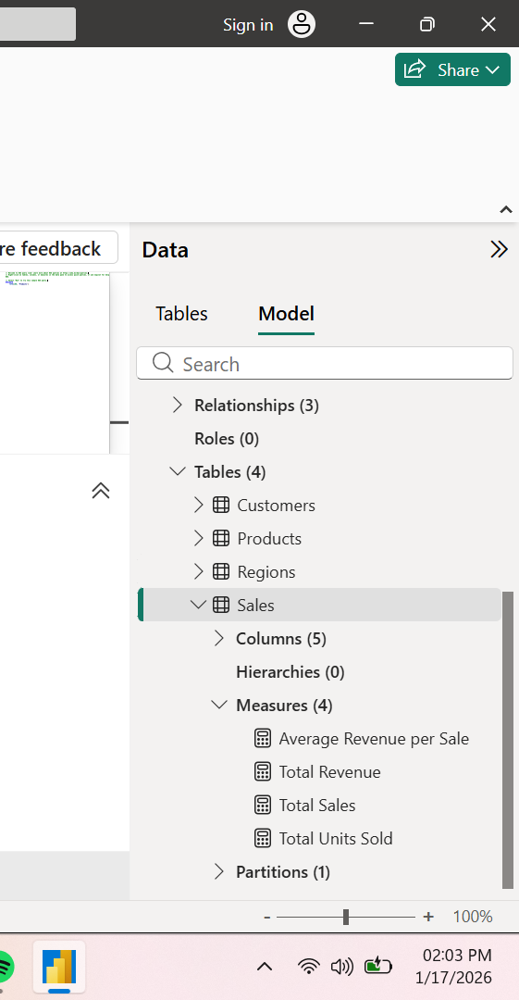
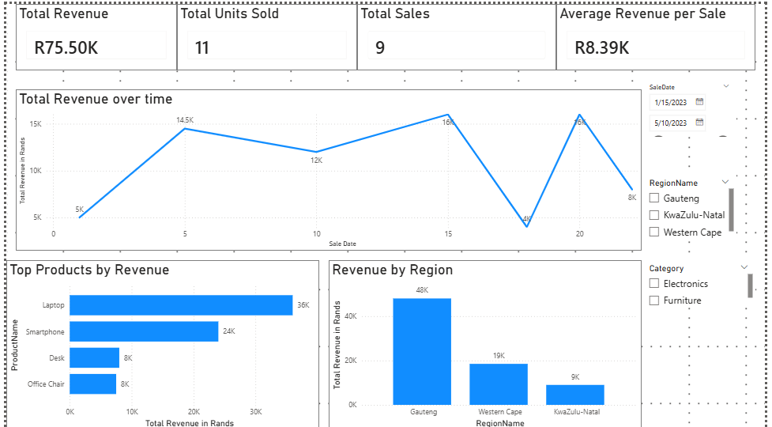
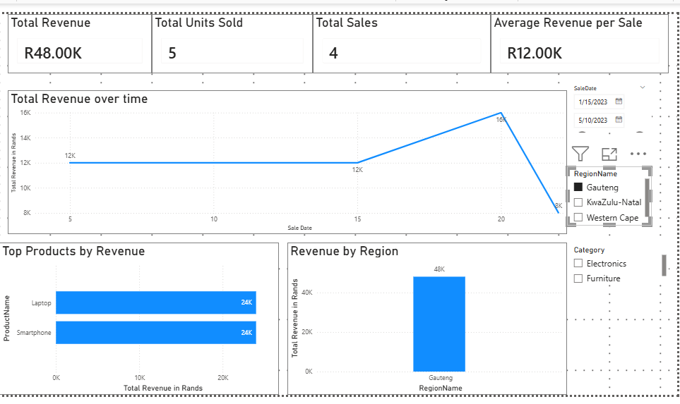

# Sales Performance Analysis Dashboard (SQL Server & Power BI)

## Overview
This project analyses sales performance data using SQL Server and Power BI.  
The objective is to evaluate revenue trends, product performance, customer contribution, and regional sales distribution to support data-driven business decisions.

---

## Business Questions Addressed
- What is the total revenue generated?
- How has revenue changed over time?
- Which products generate the most revenue?
- Which regions contribute the most to total revenue?
- What is the average revenue per sale?
  

---

## Tools & Technologies
- SQL Server for data modeling and analysis  
- Power BI for data visualization and reporting  
- DAX for calculating business metrics  

---

## Data Model
The data model consists of four core tables:
- Sales  
- Products  
- Customers  
- Regions  

These tables are connected through primary and foreign key relationships to ensure accurate analysis.

---

## Key Metrics (DAX Measures)
The following measures were created in Power BI:
- Total Revenue  
- Total Units Sold  
- Total Sales  
- Average Revenue per Sale  

---

## Dashboard Overview
The dashboard provides an interactive overview of sales performance, allowing users to explore trends using filters for date, region, and product category.

---

## Key Insights
- Revenue is concentrated in a small number of high-performing products.
- Sales performance varies significantly across regions.
- Revenue trends fluctuate over time, indicating possible seasonality or demand changes.

---

## How to Use This Project
1. Run the SQL scripts in the sql folder in sequence to create and populate the database.
2. Open the Power BI file located in the powerbi folder using Power BI Desktop.
3. Use the slicers to explore sales performance by date, region, and product category.
